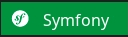

# **Application de réseau de musculation** - *Projet dev web mobile*
***Dans le cadre de notre formation en Dev Web/ Web Mobile, nous nous voyons confié le projet suivant :***

Le projet consiste à développer une application web de réseau de musculation visant à offrir aux utilisateurs une plateforme conviviale pour planifier, suivre et partager leurs séances d'entraînement, ainsi que pour trouver des partenaires d'entraînement dans leur région.

L'application fournira des fonctionnalités de programmation d'entraînement, de suivi des performances, de messagerie entre utilisateurs et de découverte de partenaires d'entraînement compatibles.

___
### *Technologies utilisées*





___
## *Installation du projet*
### *Commandes à utiliser pour installer le projet sur une machine*

*Le projet est réparti en trois dépôts :*

#### 1. Le premier est dédié au front-end.

#### 2. Le second concerne le back-end et l'api.

#### 3. Le dernier est l'application RenconSport en Flutter.

```
git clone https://github.com/florianpoteau/App-reseau-musculation-web-front.git
```
```
git clone https://github.com/florianpoteau/App-reseau-musculation-web-back.git
```
```
git clone https://github.com/florianpoteau/App-reseau-musculation-mobile.git
```
### Actuellement, ceci est le repo de l'application mobile RenconSport. C'est ici que le front-end interagit avec le back-end de l'application ainsi qu'avec l'API du repo.

___
### *Pour le suivie du projet*
***Assurez-vous de demander les permissions auprès de l'un des contributeurs de l'équipe au besoin.***

<a href="https://trello.com/invite/b/8Pvpi2sT/ATTIa21460970f516a9e8382d4b676f2a56c7404449A/projet-renconsport"></img></a>
___
### *Contributeur.ices*
___
-***Samuel Dénommé***

<a href="https://github.com/bunnyhopper363"></img></a>
<a href="https://www.linkedin.com/in/samuel-d%C3%A9nomm%C3%A9-7b9943280/]"></img></a> 

-***Florian Poteau***

<a href="https://github.com/florianpoteau"></img></a>
<a href="https://www.linkedin.com/in/florian-poteau-63a9a71a1/"></img></a> 

-***Fabien***

<a href="https://github.com/FabienFattore"></img></a>


-***Marc-Antoine***

<a href="https://github.com/Weldarn"></img></a>
